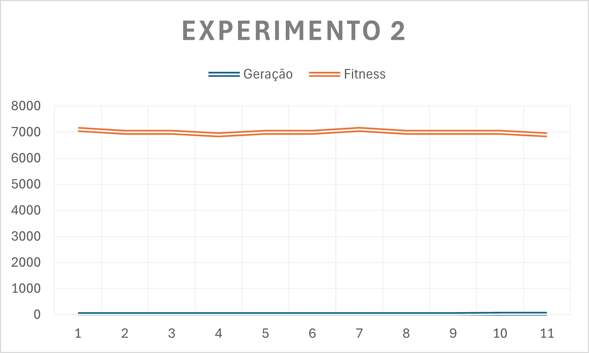

# Experimento [2] 🔬

## 💻 Configuração do experimento
- Config: config_exp2.ini
- População: 100
- Gerações: 10
- Taxa de mutação: 0.1
- Tipo de geração: apenas_movimentos_validos

## 📈 Resultado

## 📁 Relatório
- O fitness dos indivíduos permaneceu estável ao longo de cada geração.
- Indica que as mutações inteligentes não causaram grandes variações ao longo das 10 gerações.

